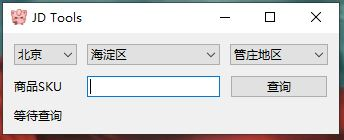
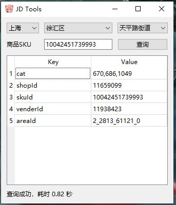

# JD Tool

本项目主要用于查询京东（JD）产品的`cat`, `shopId`, `skuId`, `venderId`, `AreaId`。

## 预览

### 主界面



### 查询结果



## 安装

以下是安装本项目所需的步骤：

```bash
# 新建虚拟环境
virtualenv venv
# 激活环境
source venv/bin/activate
# 安装依赖(一次性)
pip install -r requirements.txt
# 退出环境
deactivate
```

## 安装

你可以使用Pyinstaller来打包这个项目为可执行文件。以下是打包的命令：

```bash
pyinstaller -F -w -i logo.ico main.py -n "jd_tool"

pyinstaller jd_tool.spec
```

**注意**： 需要修改venv\Lib\site-packages\selenium\webdriver\common\service.py文件。将下面的代码添加到文件中：

```bash
self.creation_flags = self.popen_kw.pop("creation_flags", 134217728)
```

## 贡献

如果你有任何建议或问题，请随时提出issue或pull request。
